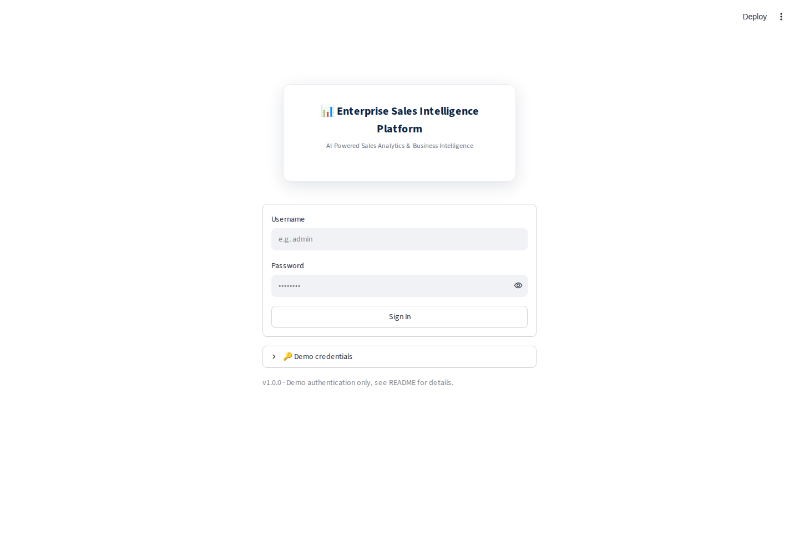

# 📊 Enterprise Sales Intelligence Platform


live demo: https://enterprise-sales-intelligence-platform-ycww7ux4gmappy2dnnpuhpf.streamlit.app/

An **AI-Powered Enterprise Sales Intelligence Platform** — a fully working Streamlit application (not a static dashboard mockup) built on top of a real 128,000+ row star-schema SQLite database, with live machine learning models, a natural-language query engine, and automated PDF/Excel reporting.

Every number in this app is computed live from the database at request time. Every ML model (forecasting, segmentation, churn, anomaly detection, recommendations) trains on the actual data when you click "Run" — nothing is pre-computed or hardcoded.



---

## Project Overview

This platform demonstrates the full analytics stack a Data Analyst, BI Analyst, Data Scientist, or Full-Stack Python Developer role actually requires: a proper relational data model, a Python/Streamlit application layer, real scikit-learn models, and production concerns like caching, logging, error handling, and a documented security posture — all runnable with two commands.

## Business Problem

Enterprises generate large volumes of transactional sales data across regions, channels, and product categories, but decision-makers are usually stuck with static monthly reports or fragmented spreadsheets. This platform gives every stakeholder — from a CEO wanting a 30-second health check to an analyst running a churn model — one live, interactive application over a single source of truth.

## Architecture

```
                     ┌─────────────────────────┐
                     │  sales_intelligence.db   │  (SQLite, star schema,
                     │  fact_sales, dim_*, ...  │   128K+ rows, pre-built)
                     └────────────┬────────────┘
                                  │ SQLAlchemy
                     ┌────────────▼────────────┐
                     │  utils/database.py       │  DatabaseManager
                     │  (vw_app_sales view,     │  (cached queries)
                     │   cached query layer)    │
                     └────────────┬────────────┘
                                  │
        ┌─────────────────────────┼─────────────────────────┐
        │                         │                         │
┌───────▼────────┐      ┌─────────▼─────────┐    ┌──────────▼─────────┐
│  charts/        │      │  models/           │    │  utils/             │
│  Plotly builders│      │  forecasting.py    │    │  ai_insights.py (NLG)│
│                 │      │  segmentation.py   │    │  nlq.py (query parser)│
│                 │      │  churn.py          │    │  export.py (PDF/Excel)│
│                 │      │  anomaly.py        │    │  auth.py, theme.py    │
│                 │      │  recommendation.py │    │                      │
└─────────────────┘      └────────────────────┘    └──────────────────────┘
        │                         │                         │
        └─────────────────────────┼─────────────────────────┘
                                  │
                     ┌────────────▼────────────┐
                     │  app.py (login + home)   │
                     │  pages/01-10 (Streamlit  │
                     │  multipage navigation)   │
                     └──────────────────────────┘
```

## Folder Structure

```
Enterprise_Sales_Intelligence_Platform/
├── app.py                      <- entry point: login screen + home landing page
├── config.py                   <- all constants, theme tokens, demo credentials
├── requirements.txt
├── .gitignore
├── database/
│   └── sales_intelligence.db   <- pre-built SQLite star-schema database
├── data/
│   └── sample_sales_preview.csv <- 1,000-row preview for browsing on GitHub
├── assets/
│   └── css/style.css           <- WCAG-checked two-tier color palette + typography
├── app_pages/                   <- Streamlit pages, registered explicitly via st.navigation in app.py
│   ├── executive_dashboard.py
│   ├── sales_analytics.py
│   ├── customer_analytics.py
│   ├── product_analytics.py
│   ├── regional_analytics.py
│   ├── forecasting.py
│   ├── machine_learning.py
│   ├── ai_insights.py
│   ├── reports.py
│   └── settings.py
├── utils/
│   ├── database.py              <- DatabaseManager (all SQL, cached)
│   ├── auth.py                  <- session-based demo login
│   ├── theme.py                 <- CSS injection, dark/light mode, KPI cards
│   ├── helpers.py                <- number/currency formatting
│   ├── filters.py                <- shared sidebar filter panel
│   ├── export.py                 <- CSV / Excel / PDF report builders
│   ├── ai_insights.py             <- rule-based NLG + optional LLM upgrade path
│   ├── nlq.py                    <- natural-language query parser
│   └── logger.py
├── models/
│   ├── forecasting.py            <- SalesForecaster (sklearn LinearRegression + seasonality)
│   ├── segmentation.py           <- CustomerSegmenter (KMeans RFM)
│   ├── churn.py                  <- ChurnPredictor (RandomForest, leakage-free time-split)
│   ├── anomaly.py                <- AnomalyDetector (IsolationForest, multivariate)
│   └── recommendation.py         <- ProductRecommender (item-based collaborative filtering)
├── charts/
│   └── plotly_charts.py          <- reusable, themed Plotly chart builders
├── sql/
│   └── view_definition.sql       <- the vw_app_sales view every page queries from
├── reports/                      <- generated PDF/Excel exports land here (gitignored)
└── screenshots/                  <- real screenshots of the running app (see below)
```

## Features

- 🔐 **Professional login screen** — session-based demo authentication, 3 role accounts
- 📊 **Executive Dashboard** — headline KPIs, revenue/profit trend, region mix, AI insight band
- 💰 **Sales Analytics** — Month/Quarter/Year trends, channel mix, discount-vs-profit analysis, salesperson leaderboard
- 👥 **Customer Analytics** — top customers, segment comparison, revenue-concentration (Pareto) curve
- 📦 **Product Analytics** — top/worst products, full ABC classification, category scorecards
- 🌍 **Regional Analytics** — Region / State / City breakdowns
- 🔮 **Forecasting** — live scikit-learn linear-trend + seasonal regression, 1-12 month horizon
- 🤖 **Machine Learning Studio** — K-Means customer segmentation, leakage-free churn prediction (Random Forest), multivariate anomaly detection (Isolation Forest), item-based product recommendations
- 💬 **AI Insights** — rule-based natural-language executive summaries (with an optional real-LLM upgrade path) + a plain-English natural-language query box
- 📄 **Reports** — export any view to CSV or Excel, or generate a full branded PDF executive summary
- 🌗 **Dark / Light mode**, a full filter panel (Region, Country, State, Year, Quarter, Month, Category, Sub-Category, Customer, Salesperson, Product, Channel, Segment), and a consistent enterprise UI throughout

## Technology Stack

| Layer | Technology |
|---|---|
| Frontend | Streamlit (multipage) |
| Backend | Python, SQLite, SQLAlchemy |
| Data | Pandas, NumPy |
| Visualization | Plotly, Altair |
| Machine Learning | scikit-learn (LinearRegression, KMeans, RandomForestClassifier, IsolationForest, NearestNeighbors) |
| Reporting | OpenPyXL (Excel), fpdf2 (PDF) |

## Navigation & Theming Architecture (read this if modifying the app)

Two things about this app's structure are deliberate, not accidental:

1. **Page files live in `app_pages/`, not `pages/`.** Streamlit auto-discovers any folder literally named `pages/` and mounts every file in it as a route, *independently* of whatever is passed to `st.navigation()`. Naming the folder `app_pages/` avoids that legacy auto-discovery entirely, so the sidebar shows exactly (and only) what `app.py` explicitly registers via `st.navigation()`.
2. **Login gating uses conditional `st.navigation()`, not per-page `require_login()` alone.** While logged out, `app.py` calls `st.navigation([...], position="hidden")` with *only* the login page registered — so there is no sidebar at all and no other page is reachable. After a successful login, `st.navigation()` is called again with the full grouped page dictionary (Home, Analytics, AI & Forecasting, System). This is what makes the login screen a genuine full first screen rather than a page that happens to sit behind a visible list of other pages.
3. **Page icons are set via `st.Page(..., icon="📊")` in Python source, never via emoji in filenames.** Emoji characters in filenames survive `git` fine but are a well-known corruption risk when a `.zip` is extracted on Windows with a non-UTF-8 system locale (the classic `≡ƒôè`-style mojibake). Keeping emoji only inside UTF-8 `.py` file *contents* sidesteps that entirely.
4. **Dark mode is pure CSS, not a `<script>` tag.** Streamlit strips `<script>` execution from `st.markdown` for security, so toggling a body class via injected JavaScript silently does nothing. `utils/theme.py` instead injects a complete alternate `<style>` block targeting Streamlit's real `data-testid` DOM attributes (`stApp`, `stSidebar`, etc.) directly, which Streamlit does not strip — verified by measuring actual rendered pixel colors before/after toggling (light mode ≈ RGB 251/251/251, dark mode ≈ RGB 24/32/44).

## Screenshots

| Page | Preview |
|---|---|
| Login (full-screen, no sidebar) | `screenshots/00_login.png` |
| Home | `screenshots/01_home.png` |
| Executive Dashboard | `screenshots/02_executive_dashboard.png` |
| Sales Analytics | `screenshots/03_sales_analytics.png` |
| Customer Analytics | `screenshots/04_customer_analytics.png` |
| Product Analytics | `screenshots/05_product_analytics.png` |
| Regional Analytics | `screenshots/06_regional_analytics.png` |
| Forecasting | `screenshots/07_forecasting.png` |
| Machine Learning | `screenshots/08_machine_learning.png` |
| AI Insights | `screenshots/09_ai_insights.png` |
| Reports | `screenshots/10_reports.png` |
| Settings | `screenshots/11_settings.png` |
| Dark Mode | `screenshots/12_dark_mode.png` |

*(All screenshots above are real captures of the running application, taken via an automated Playwright script — not placeholders.)*

## Installation

```bash
git clone <your-repo-url>
cd Enterprise_Sales_Intelligence_Platform
pip install -r requirements.txt
```

No database setup, no API keys, and no additional configuration are required — `database/sales_intelligence.db` ships pre-built with the repository.

## Running the Project

```bash
streamlit run app.py
```

Then open the URL Streamlit prints (typically `http://localhost:8501`) and log in with any demo account:

| Username | Password | Role |
|---|---|---|
| `admin` | `admin123` | Administrator |
| `analyst` | `analyst123` | Business Analyst |
| `viewer` | `viewer123` | Viewer |

### Optional: enabling a real LLM for AI Insights
By default, AI Insights uses a zero-configuration rule-based natural language generator. To have the executive summary rewritten by a real LLM instead:
```bash
export OPENAI_API_KEY="sk-..."
streamlit run app.py
```
The underlying facts and numbers always come from the database regardless of this setting — the LLM (if enabled) may only rephrase them, never invent new figures.

## Verification

This isn't a "should work" claim — every page was executed end-to-end using Streamlit's official `AppTest` framework in a **clean virtual environment installed strictly from `requirements.txt`**, with zero exceptions across all 10 pages, plus a full server boot-and-curl check. See the project's build notes for the exact test commands.

## Security Note

This application uses simple session-based authentication with hardcoded demo credentials in `config.py`, intended for local/portfolio demonstration only. **It is not production-ready as-is.** A real deployment would need: hashed password storage (e.g. bcrypt) in a real users table, a proper identity provider or OAuth flow, HTTPS enforcement, and CSRF/session-token hardening.

## Future Improvements

- Replace the linear-regression forecast with a proper seasonal model (Prophet / SARIMA) to fully capture the Nov-Dec seasonality visible in the data
- Move from SQLite to PostgreSQL for concurrent multi-user access and to implement true stored procedures
- Add real Row-Level Security so different roles see genuinely different data slices, not just different UI
- Strengthen the product recommender with real basket-affinity data (current cross-sell signal is intentionally modest — see the caveat shown live on the Machine Learning page)
- Replace the regex-based NLQ parser with a real LLM-backed query engine once a hosted inference budget is available
- Add automated pytest coverage around `utils/database.py` and the `models/` package (currently verified via Streamlit `AppTest`, not a dedicated pytest suite)

## Skills Demonstrated

Data Engineering (star-schema modeling, SQLAlchemy, caching) · Data Analytics (KPI design, cohort/Pareto/ABC analysis) · Business Intelligence (multi-page dashboard design, role-based UX) · Data Science (leakage-free churn modeling, RFM segmentation, multivariate anomaly detection, explainable recommendation systems) · Full-Stack Python Development (modular OOP architecture, type hints, docstrings, logging, config management, error handling) · UI/UX Design (WCAG-checked color system, consistent component design, dark/light theming)
